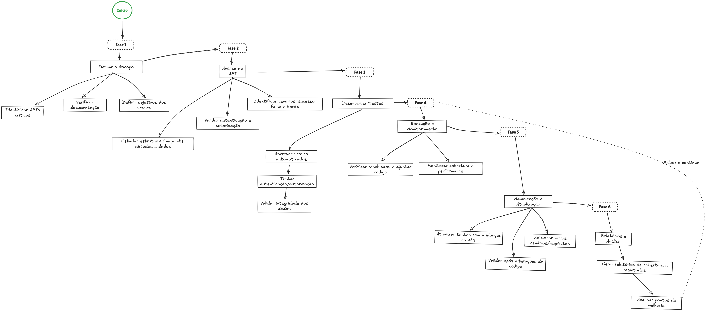

# API Testing Lifecycle

Este repositório documenta um **processo estruturado para planejamento, desenvolvimento e manutenção de testes de APIs**. O objetivo é fornecer uma visão clara das fases envolvidas, desde a definição do escopo até a melhoria contínua.

[Arquivo Excalidraw](./docs/Teste-API-Map-2025.excalidraw)

## 📌 Estrutura do Processo
O ciclo de testes está dividido em fases:

1. **Definir o Escopo**
   - Identificar APIs críticas
   - Verificar documentação
   - Definir objetivos dos testes
   - Estudar endpoints, métodos e dados

2. **Análise da API**
   - Identificar cenários de sucesso, falha e borda
   - Validar autenticação e autorização

3. **Desenvolver Testes**
   - Escrever testes automatizados
   - Testar autenticação/autorização
   - Validar integridade dos dados

4. **Execução e Monitoramento**
   - Verificar resultados e ajustar código
   - Monitorar cobertura e performance

5. **Manutenção e Atualização**
   - Atualizar testes com mudanças na API
   - Adicionar novos cenários/requisitos
   - Validar após alterações de código

6. **Relatórios e Análise**
   - Gerar relatórios de cobertura e resultados
   - Analisar pontos de melhoria

## 🎯 Objetivo
Garantir **qualidade contínua** nos testes de API, promovendo maior confiabilidade, rastreabilidade e evolução constante.

## 📂 Conteúdo esperado
- `README.md` (documentação principal)
- `fluxograma.png` (imagem do fluxograma)
- `/tests` (exemplos de automação)
- `/docs` (documentação adicional)

## Contribuições
Contribuições são bem-vindas — abra uma issue ou envie um pull request com melhorias.

